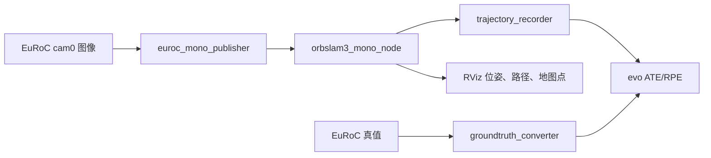
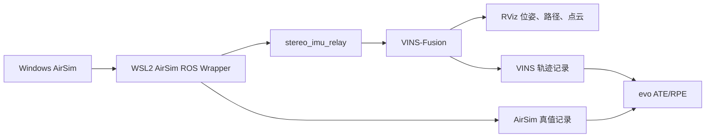
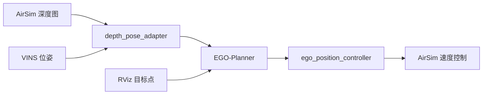

# ROS SLAM 与 AirSim 实践工程设计

## 1. 目标与交付边界

本仓库面向 Ubuntu 20.04、ROS Noetic 和 WSL2，交付两个可复现的实践任务：

1. 使用 EuRoC MAV Dataset 左目图像运行 ORB-SLAM3 单目模式，记录轨迹，并用 evo 计算 ATE 与 RPE。
2. 在 Windows 运行 AirSim，在 WSL2 运行 AirSim ROS Wrapper 与 VINS-Fusion，接入双目图像和 IMU，输出实时位姿、路径与稀疏点云并在 RViz 显示。
3. 额外提供 EGO-Planner 接入层，把 AirSim 深度图和 VINS 位姿送入规划器，并把规划位置指令转换为 AirSim 世界坐标系速度指令。

仓库包含源代码、配置、Launch、安装脚本、自动测试、逐节点实践记录和结果填写模板。数据集、第三方算法源码、编译产物、真实实验截图和录屏不提交到仓库。

在当前环境中无法启动 ROS、AirSim、ORB-SLAM3 或 VINS-Fusion，因此不得填写虚假的 ATE/RPE 数值，也不得将未运行的节点记录成“已验证”。能够在纯 Python 环境验证的解析、轨迹格式、坐标变换、命令生成和控制逻辑必须由自动测试覆盖。

## 2. 总体架构

### 2.1 任务一数据流

数据读取与 SLAM 解耦。后续收到指定视频时，增加自定义数据清单和相机 YAML 即可复用 ORB-SLAM3 节点、轨迹记录与评估流程。

### 2.2 任务二数据流

AirSim 使用 ENU 世界坐标系。左右相机使用同一时间戳，IMU 保留 AirSim ROS Wrapper 的消息时间。VINS-Fusion 使用固定双目与 IMU 外参，后续可切换为在线外参估计进行调试。

### 2.3 选做避障数据流

规划器不直接使用 AirSim 真值位姿，定位输入来自 VINS-Fusion。AirSim 真值只用于评估。

## 3. ROS 节点边界

| 节点 | 主要输入 | 主要输出 | 责任 |
|---|---|---|---|
| `euroc_mono_publisher` | EuRoC `cam0/data.csv` | `/camera/mono/image_raw`、`camera_info` | 按时间戳发布左目图像 |
| `orbslam3_mono_node` | 单目图像 | `/orbslam3/pose`、`odometry`、`path`、`tracked_points` | 调用 ORB-SLAM3 并发布结果 |
| `trajectory_recorder` | PoseStamped 或 Odometry | TUM 轨迹文件 | 通用轨迹落盘 |
| `stereo_imu_relay` | AirSim 左右图像和 IMU | `/vins_fusion/cam0`、`cam1`、`imu` | 灰度化、双目同步与 Topic 规范化 |
| `vins_node` | 双目图像和 IMU | 私有命名空间下的 odometry、path、point_cloud | 双目视觉惯导估计 |
| `vins_output_adapter` | VINS odometry/path | `/slam_practice/vins/*` 与 TF | 为 RViz 和其他节点提供稳定接口 |
| `airsim_gt_recorder` | AirSim `odom_local_enu` | TUM 真值轨迹 | 记录仿真真值，仅用于评估 |
| `depth_pose_adapter` | AirSim DepthPlanner、VINS odometry | EGO 深度图与相机位姿 | 规划感知输入适配 |
| `ego_position_controller` | EGO PositionCommand、VINS odometry | AirSim VelCmd | 位置误差反馈与速度限幅 |

## 4. 坐标系与时间约束

- ROS 世界坐标统一使用 ENU：x 东、y 北、z 上。
- AirSim ROS Wrapper 启用 `world_enu` 与 `coordinate_system_enu=true`。
- 相机光学系使用 x 右、y 下、z 前。
- EuRoC 纳秒时间戳转换为 ROS 秒时保留双精度。
- 单目 ORB-SLAM3 评估必须使用 SE(3) 对齐和尺度校正，即 evo 的 `--align --correct_scale`。
- 双目惯导 VINS-Fusion 评估只进行 SE(3) 对齐，不进行尺度校正。
- 所有 TUM 轨迹行格式固定为 `timestamp tx ty tz qx qy qz qw`。

## 5. 失败处理与可观测性

- 数据清单缺失、图像不存在、时间戳倒序时，发布节点启动即失败并打印明确路径。
- ORB-SLAM3 跟踪失败时不发布无效位姿，但继续接收后续帧以支持重定位。
- 双目时间差超过 3 ms 时丢弃较早帧，并通过节流日志记录丢帧。
- VINS 未初始化前，不向 EGO-Planner 发布相机位姿，不启用飞行控制。
- 控制器对水平、垂直速度分别限幅；没有新指令或定位超时则发布零速度。
- 实践记录区分“代码检查通过”“ROS 编译通过”“真实运行通过”三种状态。

## 6. 验证标准

### 静态与自动验证

- Python 标准库 `unittest` 全部通过。
- 所有 Python 文件通过 `compileall`。
- JSON、YAML/XML Launch 文件可解析。
- Shell 脚本通过 `bash -n`。
- ROS 环境中 `catkin_make` 能编译 `slam_practice` 与 `orbslam3_ros`。

### 任务一验收

- MH_01_easy 左目图像能连续发布，ORB-SLAM3 能完成初始化并显示稀疏地图。
- 估计轨迹和真值轨迹均生成 TUM 文件。
- evo 输出 ATE、RPE 压缩结果、指标表和轨迹图。
- 后续自定义视频只需替换数据路径、时间戳清单和相机 YAML。

### 任务二验收

- AirSim ROS Wrapper 在 WSL2 能连接 Windows AirSim。
- 双目图像时间差不超过 3 ms，IMU 频率和图像频率满足 VINS-Fusion 配置。
- RViz 实时显示 VINS 位姿、路径与点云。
- 估计轨迹可与 AirSim 真值用 evo 比较。

### 选做任务验收

- RViz 发送目标点后，EGO-Planner 发布规划轨迹和 PositionCommand。
- 控制器输出有限速度，AirSim 无人机绕开深度感知到的障碍物并到达目标邻域。
- 录屏同时包含 AirSim 窗口和 RViz 规划轨迹。

## 7. 关键风险

| 风险 | 触发条件 | 处理 |
|---|---|---|
| WSL2 无法连接 AirSim RPC | Windows 防火墙或 Host IP 错误 | 自动检测 `/etc/resolv.conf` 的 nameserver，并允许 41451 端口 |
| VINS 初始化失败 | IMU 轴向、重力方向或外参错误 | 静止检查加速度模长，核对 ENU 与光学系旋转，必要时启用外参估计 |
| 单目轨迹尺度错误 | 未进行尺度校正 | 评估命令强制 `--correct_scale` |
| ORB-SLAM3 编译失败 | Pangolin、OpenCV、Boost 或 GCC 版本不兼容 | 固定 Ubuntu 20.04/Noetic，分阶段构建依赖并保留诊断命令 |
| EGO 规划正常但飞行发散 | VINS 延迟、控制增益过大或坐标系不一致 | 先悬停验证，再低速限幅测试，最后启用障碍环境 |
| 结果被误当成真实实验 | 只生成模板但未实际运行 | 所有未运行记录明确标注“待实机验证”，不提供示例伪数值 |

